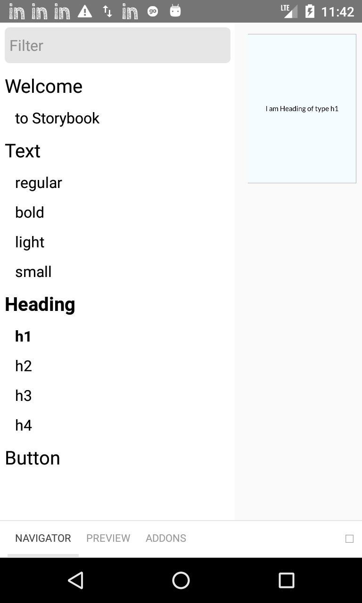
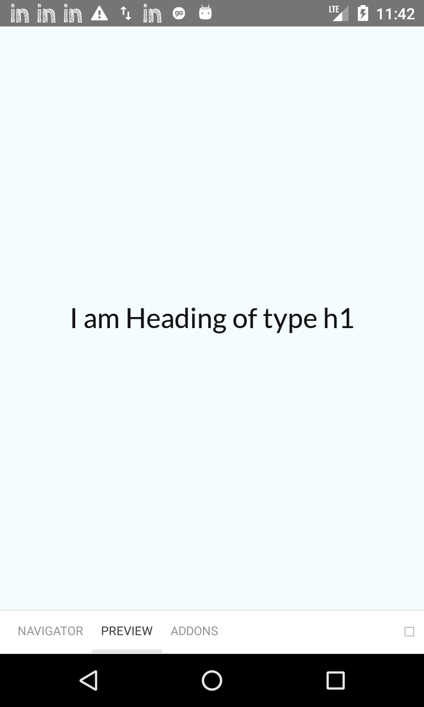

# react-native-components
Design library for react-native

### Design guide
https://www.figma.com/file/8wxizvQ1u2RnV4WAaM1VuK/Host-App-Components

### Development Setup

1. Clone the repository: `git clone https://github.com/goibibo-labs/react-native-components.git`
2. Move to project: `cd react-native-components`
3. Install dependencies: `yarn install`
4. Move to App folder: `cd RNComponents`
5. Install dependencies: `yarn install`
6. Start the Metro Server: `npx react-native start`
7. Run android app (in a separate terminal): `react-native run-android`

You would be able to see all stories in App. 
If you wish to control navigation from Browser, you can follow below commands-

1. Forward port 7007: `adb reverse tcp:7007 tcp:7007`
2. Star storybook server: `yarn storybook`

This will open http://localhost:7007/ in Browser where you can see Navigator.
Not that this will still show Preview on App & not on Web but from here you can control Navigator.

### Development Guidelines

1. Always declare `propTypes` & `defaultProps`
2. Every component must accept `style` prop
3. Always specify the underlying react-native element's proptypes and pass the `remainingProps` to it
```
Text.propTypes = {
  ...RNText.propTypes,
  style: PropTypes.oneOfType([
    PropTypes.object,
    PropTypes.number,
    PropTypes.array
  ])
}
```
```
return (
  <RNText style={[...textStyles, style]} {...remainingProps}>
    {children}
  </RNText>
)
```
4. Always specify the story of your component in Storybook with diverse variations: https://storybook.js.org/docs/react/writing-stories/introduction

### Screenshots

 
